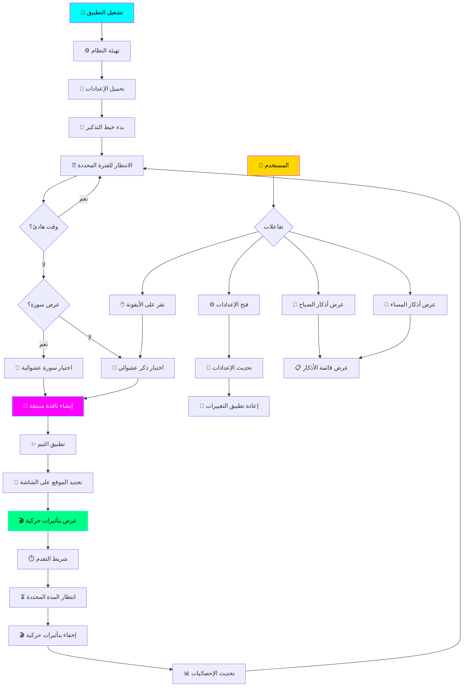

# 🌙 ذِكْر - برنامج التذكير بذكر الله

<div align="center">


**برنامج احترافي للتذكير بالأذكار والسور القرآنية**
يعمل في خلفية النظام مع واجهة سايبربنك أنيقة ✨

</div>

---

## 📖 نظرة عامة

**ذِكْر** هو تطبيق سطح مكتب مصمم لمساعدتك على المواظبة على ذكر الله في حياتك اليومية. يعمل البرنامج بهدوء في الخلفية ويُظهر تذكيرات جميلة منبثقة بالأذكار والسور القرآنية في أوقات منتظمة.

### ✨ المميزات الرئيسية

- 🔔 **تذكيرات تلقائية** - إشعارات منبثقة للأذكار والسور
- 🎨 **13 ثيم جميل** - ثيمات داكنة وفاتحة قابلة للتخصيص
- 🌅 **أذكار الصباح والمساء** - مجموعة كاملة من الأذكار اليومية
- 📿 **+20 ذكر** - مجموعة منتقاة من الأذكار الصحيحة
- 📖 **سور قرآنية** - عرض السور القرآنية القصيرة
- 🎯 **وضع الهدوء** - تعطيل التذكيرات في أوقات محددة
- 📊 **تتبع الإحصائيات** - متابعة عدد الأذكار اليومية والإجمالية
- 💻 **خفيف على النظام** - يعمل في الخلفية دون استهلاك موارد
- 🔧 **قابل للتخصيص بالكامل** - تحكم في كل التفاصيل

---

## 🏗️ معمارية البرنامج



### 🔧 مكونات البرنامج

| المكون | الوصف |
|--------|-------|
| **SettingsManager** | إدارة وحفظ الإعدادات في ملف JSON |
| **ReminderPopup** | النافذة المنبثقة لعرض الأذكار بثيمات متعددة |
| **ReminderThread** | خيط منفصل للتحقق من التوقيت وعرض التذكيرات |
| **SettingsWindow** | واجهة الإعدادات الكاملة مع 5 تبويبات |
| **TrayIcon** | أيقونة في شريط النظام مع قائمة سياقية |

---

## 📥 التثبيت للمبتدئين

### المتطلبات

- 💻 نظام Windows 10 أو أحدث
- 🐍 Python 3.8 أو أحدث
- 📦 PyQt6 (سيتم تثبيته تلقائياً)

### 📝 خطوات التثبيت

#### الخطوة 1️⃣: تثبيت Python

1. افتح متصفح الإنترنت
2. اذهب إلى: [python.org/downloads](https://www.python.org/downloads/)
3. اضغط على زر التحميل الكبير (Download Python)
4. بعد التحميل، افتح الملف المحمل
5. ⚠️ **مهم جداً**: ضع علامة ✅ على المربع:
   ```
   ☑️ Add Python to PATH
   ```
6. اضغط على "Install Now"
7. انتظر حتى ينتهي التثبيت
8. اضغط "Close"

#### الخطوة 2️⃣: تحميل البرنامج

**الطريقة 1: من GitHub**
1. اذهب إلى: [github.com/faisald2926/thikr](https://github.com/faisald2926/thikr)
2. اضغط على الزر الأخضر "Code"
3. اختر "Download ZIP"
4. بعد التحميل، انقر بزر الماوس الأيمن على الملف
5. اختر "Extract All..." (استخراج الكل)
6. اختر مكان الاستخراج واضغط "Extract"

**الطريقة 2: باستخدام Git**
```bash
git clone https://github.com/faisald2926/thikr.git
cd thikr
```

#### الخطوة 3️⃣: تثبيت المكتبات المطلوبة

1. افتح المجلد الذي استخرجت فيه البرنامج
2. اضغط على شريط العنوان في الأعلى واكتب: `cmd` ثم اضغط Enter
3. سيفتح نافذة سوداء (موجه الأوامر)
4. اكتب الأمر التالي واضغط Enter:
   ```bash
   pip install -r requirements.txt
   ```
5. انتظر حتى ينتهي التثبيت

> **ملاحظة:** إذا ظهرت رسالة خطأ، جرب هذا الأمر:
> ```bash
> python -m pip install PyQt6
> ```

#### الخطوة 4️⃣: تشغيل البرنامج

**الطريقة السريعة:**
- انقر مرتين على ملف: **`تشغيل_ذكر.bat`**

**الطريقة اليدوية:**
1. افتح نافذة موجه الأوامر كما في الخطوة 3
2. اكتب:
   ```bash
   python thikr.py
   ```

---

## 🎯 طريقة الاستخدام

### 🔍 أين أجد البرنامج؟

بعد تشغيل البرنامج، ستجد أيقونة **ذ** باللون الأخضر في شريط النظام (بجانب الساعة والتاريخ في الأسفل على اليمين).

<div align="center">

```
┌─────────────────────────────────────┐
│  🔊 🔋 🌐 💬 [ذ]  🕐 12:30 PM     │
└─────────────────────────────────────┘
```

</div>

### 🖱️ التفاعل مع البرنامج

| الإجراء | النتيجة |
|---------|---------|
| نقرة واحدة بالزر الأيسر | عرض ذكر عشوائي فوراً |
| نقرة مزدوجة | فتح نافذة الإعدادات |
| نقرة بالزر الأيمن | عرض القائمة الكاملة |

### 📋 القائمة الرئيسية

عند النقر بزر الماوس الأيمن على الأيقونة:

```
┌─────────────────────────────┐
│  📿 عرض ذكر              │
│  🌅 أذكار الصباح          │
│  🌙 أذكار المساء          │
│  📖 عرض سورة             │
│  ──────────────────────   │
│  ⏸️ إيقاف مؤقت           │
│  ⚙️ الإعدادات            │
│  📊 الإحصائيات           │
│  ──────────────────────   │
│  ❌ خروج                  │
└─────────────────────────────┘
```

#### شرح القائمة:

- 📿 **عرض ذكر**: يظهر ذكر عشوائي من المجموعة
- 🌅 **أذكار الصباح**: يعرض جميع أذكار الصباح بالترتيب
- 🌙 **أذكار المساء**: يعرض جميع أذكار المساء بالترتيب
- 📖 **عرض سورة**: يعرض سورة قرآنية عشوائية
- ⏸️ **إيقاف مؤقت**: يوقف التذكيرات التلقائية مؤقتاً
- ⚙️ **الإعدادات**: يفتح نافذة الإعدادات الكاملة
- 📊 **الإحصائيات**: يعرض عدد الأذكار (يومي/إجمالي)
- ❌ **خروج**: يغلق البرنامج نهائياً

---

## ⚙️ الإعدادات

### 🔔 تبويب التذكيرات

```
┌─────────────────────────────────────────┐
│  التشغيل التلقائي                      │
│  ☑️ تشغيل البرنامج مع بدء Windows     │
├─────────────────────────────────────────┤
│  التذكيرات الأساسية                    │
│  ☑️ تفعيل التذكيرات                   │
│  الفترة (دقيقة): [60]                 │
│  ☑️ ترتيب عشوائي                      │
│  ☑️ إظهار الفضيلة                     │
├─────────────────────────────────────────┤
│  وقت الهدوء                            │
│  ☑️ تفعيل وقت الهدوء                  │
│  من: [23:00]  إلى: [06:00]           │
├─────────────────────────────────────────┤
│  تذكيرات السور                         │
│  ☑️ تفعيل تذكيرات السور               │
│  عرض سورة كل: [3] أيام                │
└─────────────────────────────────────────┘
```

### 🎨 تبويب المظهر

**الثيمات المتاحة:**

#### 🌙 الثيمات الداكنة:
1. **سايبربنك داكن** - أزرق نيون مع بنفسجي (الافتراضي)
2. **نيون متوهج** - وردي وبنفسجي مع أزرق سماوي
3. **ذهبي إسلامي** - ذهبي فاخر على خلفية داكنة
4. **أعماق المحيط** - أزرق عميق هادئ
5. **ليل زمردي** - أخضر نيون زمردي
6. **بنفسجي ملكي** - بنفسجي فاخر
7. **غروب دافئ** - برتقالي دافئ

#### ☀️ الثيمات الفاتحة:
8. **فاتح بسيط** - رمادي وأبيض مع أزرق
9. **أبيض نظيف** - أبيض نقي مع أزرق غامق
10. **كريمي ناعم** - بيج وبني ناعم
11. **نعناعي منعش** - أخضر فاتح
12. **سماوي صافي** - أزرق سماوي
13. **وردي فاتح** - وردي رقيق

**خيارات التخصيص:**

```
┌─────────────────────────────────────────┐
│  الثيم: [سايبربنك داكن ▼]             │
│  موضع النافذة: [أسفل اليمين ▼]        │
│  ────────────────────────────            │
│  العرض: [450] بكسل                     │
│  الارتفاع: [220] بكسل                  │
│  ────────────────────────────            │
│  حجم الخط: [20] بكسل                   │
│  الشفافية: [95]%                       │
│  زاوية الحدود: [15] بكسل               │
│  مدة العرض: [8] ثانية                  │
└─────────────────────────────────────────┘
```

**مواضع النافذة:**
- أعلى اليمين / أعلى اليسار / أعلى الوسط
- أسفل اليمين / أسفل اليسار / أسفل الوسط
- الوسط

### 🔊 تبويب الصوت

```
┌─────────────────────────────────────────┐
│  ☑️ تفعيل الصوت                        │
│  مستوى الصوت: ────●────── [30]%       │
│  ────────────────────────────            │
│  🔊 اختبار الصوت                       │
└─────────────────────────────────────────┘
```

### 📿 تبويب الأذكار

يمكنك إضافة أذكار مخصصة:

```
┌─────────────────────────────────────────┐
│  الأذكار المخصصة                       │
│  ────────────────────────────            │
│  النص:                                  │
│  [أدخل نص الذكر هنا...]               │
│  ────────────────────────────            │
│  التصنيف: [تسبيح ▼]                   │
│  الفضيلة: [اختياري...]                │
│  ────────────────────────────            │
│  [+ إضافة ذكر جديد]                    │
│  ────────────────────────────            │
│  📋 قائمة الأذكار المخصصة:            │
│  1. [ذكرك المخصص] [🗑️]                │
└─────────────────────────────────────────┘
```

### 📊 تبويب الإحصائيات

```
┌─────────────────────────────────────────┐
│  إحصائيات اليوم                        │
│  ────────────────────────────            │
│  📿 عدد الأذكار اليوم: 24              │
│  📖 التاريخ: 2026-01-18                │
│  ────────────────────────────            │
│  الإحصائيات الإجمالية                  │
│  ────────────────────────────            │
│  🎯 إجمالي الأذكار: 1,247             │
│  📅 تاريخ البدء: 2025-12-01            │
│  ────────────────────────────            │
│  [🔄 إعادة تعيين اليومي]               │
└─────────────────────────────────────────┘
```

---

## 📂 هيكل المشروع

```
ذكر_Thikr/
│
├── 📄 thikr.py                 # الملف الرئيسي للبرنامج
├── 📄 requirements.txt         # المكتبات المطلوبة
├── 📄 README.md               # هذا الملف
├── 🔧 تشغيل_ذكر.bat          # ملف التشغيل السريع
│
├── 📁 data/                   # مجلد البيانات (يُنشأ تلقائياً)
│   ├── user_settings.json    # إعدادات المستخدم المحفوظة
│   └── athkar.json           # بيانات الأذكار الإضافية
│
├── 📁 sounds/                 # مجلد الأصوات (اختياري)
│   └── notification.wav      # صوت التنبيه
│
└── 📁 themes/                 # مجلد الثيمات المخصصة (مستقبلي)
```

---

## 🎨 مثال على النافذة المنبثقة

```
┌────────────────────────────────────────────────┐
│  ذِكْر                                    ✕  │
│                                                │
│        سُبْحَانَ اللَّهِ وَبِحَمْدِهِ         │
│      سُبْحَانَ اللَّهِ الْعَظِيمِ             │
│                                                │
│    كلمتان خفيفتان على اللسان               │
│    ثقيلتان في الميزان حبيبتان إلى الرحمن    │
│                                                │
│ ████████████████░░░░░░░░░░░░░░░░░░░░░░░░      │
└────────────────────────────────────────────────┘
```

---

## 🔧 استكشاف الأخطاء

### ❌ المشكلة: "Python is not recognized"

**الحل:**
1. افتح "Control Panel" (لوحة التحكم)
2. اختر "System" (النظام)
3. اختر "Advanced system settings" (إعدادات النظام المتقدمة)
4. اضغط "Environment Variables" (متغيرات البيئة)
5. في "System Variables"، ابحث عن "Path"
6. اضغط "Edit"، ثم "New"
7. أضف مسار Python (عادة):
   ```
   C:\Users\<اسمك>\AppData\Local\Programs\Python\Python3XX
   C:\Users\<اسمك>\AppData\Local\Programs\Python\Python3XX\Scripts
   ```

### ❌ المشكلة: لا تظهر الأيقونة في شريط النظام

**الحل:**
1. تأكد من أن البرنامج يعمل (تحقق من Task Manager)
2. قد تكون الأيقونة مخفية:
   - اضغط على السهم ^ بجانب الساعة
   - اسحب أيقونة ذ إلى الشريط الرئيسي

### ❌ المشكلة: لا تظهر النوافذ المنبثقة

**الحل:**
1. افتح الإعدادات
2. تأكد من تفعيل ☑️ "تفعيل التذكيرات"
3. تحقق من إعدادات "وقت الهدوء"
4. جرب زر "معاينة" لاختبار العرض

### ❌ المشكلة: الخط العربي لا يظهر بشكل صحيح

**الحل:**
- البرنامج يستخدم الخطوط الافتراضية للنظام
- تأكد من تثبيت خطوط عربية جيدة مثل:
  - "Segoe UI" (مثبت افتراضياً)
  - "Traditional Arabic"
  - "Simplified Arabic"

---

## 🤝 المساهمة

نرحب بمساهماتكم! إذا كان لديك اقتراحات أو تحسينات:

1. 🍴 Fork المشروع
2. 🌿 أنشئ فرع للميزة (`git checkout -b feature/AmazingFeature`)
3. 💾 Commit التغييرات (`git commit -m 'إضافة ميزة رائعة'`)
4. 📤 Push للفرع (`git push origin feature/AmazingFeature`)
5. 🔃 افتح Pull Request

---

## 📜 الترخيص

هذا المشروع مرخص تحت رخصة MIT - انظر ملف `LICENSE` للتفاصيل.

---

## 🤲 دعاء

اللهم اجعل هذا العمل خالصاً لوجهك الكريم، وانفع به عبادك المسلمين.

اللهم اجعله في ميزان حسناتنا وحسنات والدينا يوم القيامة.

---

## 📞 التواصل

إذا واجهت أي مشاكل أو كان لديك أسئلة:

- 📧 افتح Issue على GitHub
- 🌐 زر الصفحة الرئيسية للمشروع: [github.com/faisald2926/thikr](https://github.com/faisald2926/thikr)

---

<div align="center">

**سبحان الله وبحمده، سبحان الله العظيم** 🌙

*صُنع بـ ❤️ للتقرب إلى الله*

</div>

---

## 🎯 ملاحظات تقنية للمطورين

### متطلبات التطوير

```bash
Python >= 3.8
PyQt6 >= 6.4.0
```

### البنية التقنية

- **Framework**: PyQt6
- **Threading**: QThread لتجنب تجميد الواجهة
- **Data Storage**: JSON للإعدادات
- **Architecture**: Event-driven مع Signals/Slots

### تشغيل من المصدر

```bash
# استنساخ المشروع
git clone https://github.com/faisald2926/thikr.git
cd thikr

# تثبيت المتطلبات
pip install -r requirements.txt

# تشغيل البرنامج
python thikr.py
```

### بناء Executable

لإنشاء ملف .exe قابل للتوزيع:

```bash
pip install pyinstaller
pyinstaller --onefile --windowed --icon=icon.ico --name="ذكر" thikr.py
```

---

## 📋 خارطة الطريق

### الإصدار 1.1 (قريباً)
- [ ] إضافة المزيد من الأذكار
- [ ] دعم اللغة الإنجليزية
- [ ] ثيمات قابلة للتخصيص بالكامل
- [ ] تصدير/استيراد الأذكار

### الإصدار 2.0 (المستقبل)
- [ ] تطبيق Android/iOS مرافق
- [ ] مزامنة سحابية للإحصائيات
- [ ] تحديات وأهداف يومية
- [ ] مشاركة الإحصائيات مع الأصدقاء
